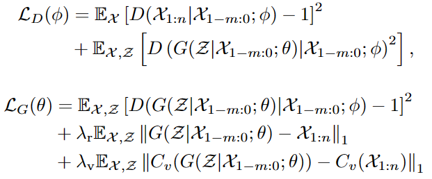
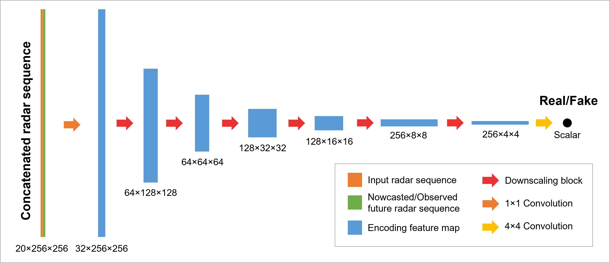
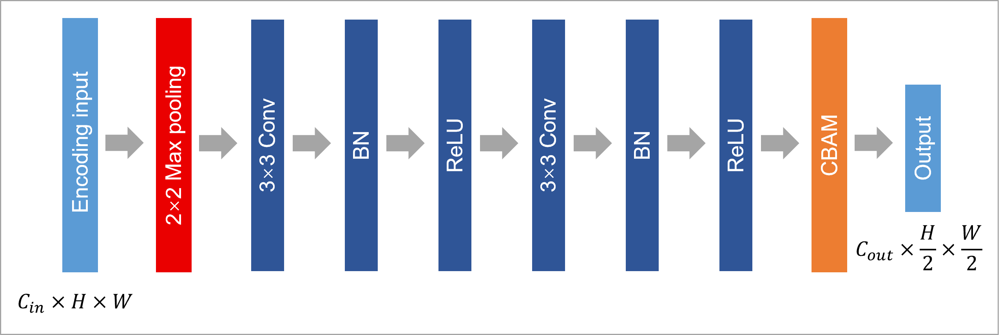
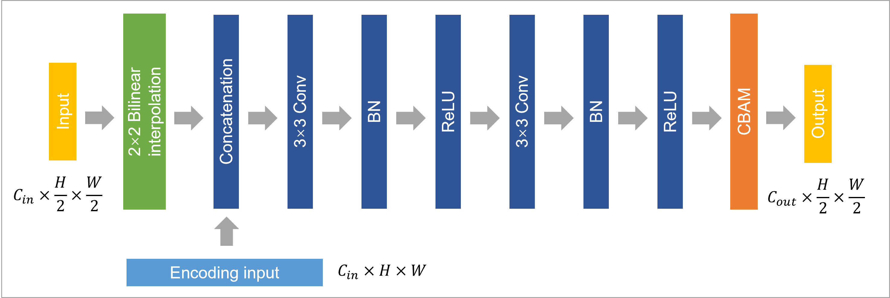

# Enhancing Spatial Variability Representation of Radar Nowcasting

This repo contains a PyTorch implementation of the **Spatial Variability Representation Enhancement (SVRE)** method and the **Attentional Generative Adversarial Network (AGAN)** for improving radar nowcasting.

## SVRE method



## Architecture of AGAN

Generator


Discriminator


Scaling blocks




## Performance overview

## Dependencies

Since the codes are based on Python, you need to install Python 3.8 first. The following dependencies are also needed.

```pytorch=1.11.0
numpy=1.20.3
netcdf4=1.5.7
pandas=1.4.3
matplotlib=3.5.1
cartopy=0.20.3
pyproj=3.3.1
pysteps=1.4.1
```

## Usage

Run the bash scripts to train the model with the radar dataset.

Ablation experiment

```cd
sh AttnUNet.sh
sh AttnUNet_SVRE.sh
sh AttnUNet_GA.sh
sh AttnUNet_GASVRE.sh
```

Comparison experiment

```cd
sh PySTEPS.sh
sh ConvLSTM.sh
sh SmaAt_UNet.sh
sh AttnUNet_GASVRE.sh
```

The intermediate products, such as the feature maps and the
pretrained models are available upon request.

<!-- ## Citation -->

<!-- If you find this repo helpful, please cite the following article. -->
