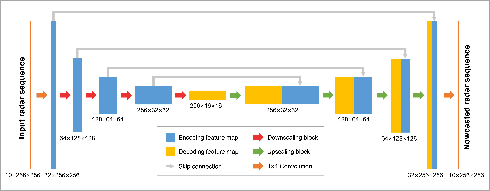
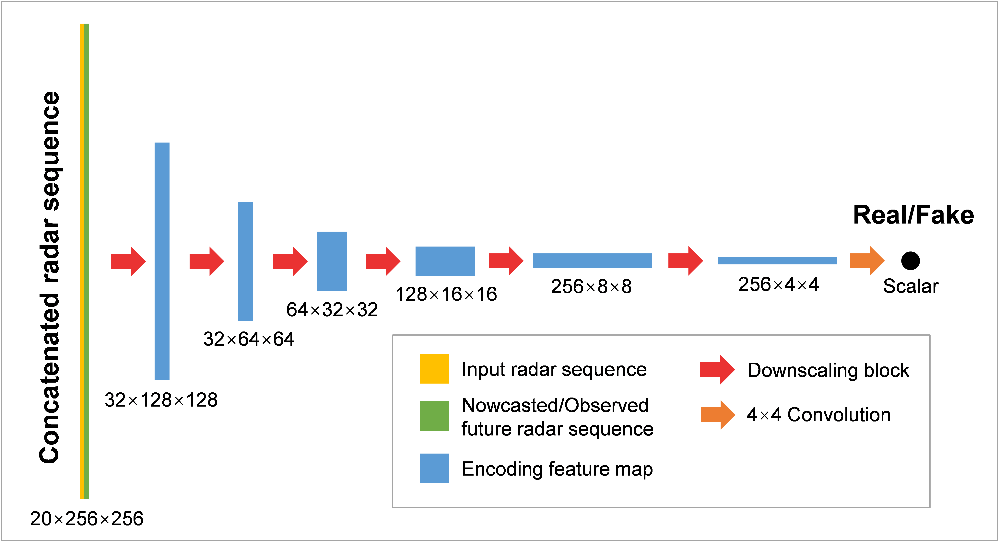
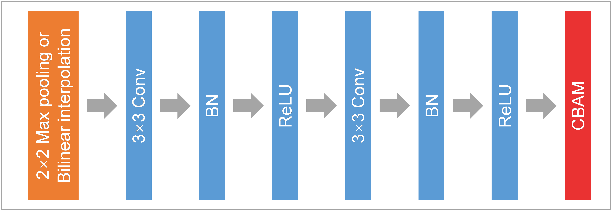
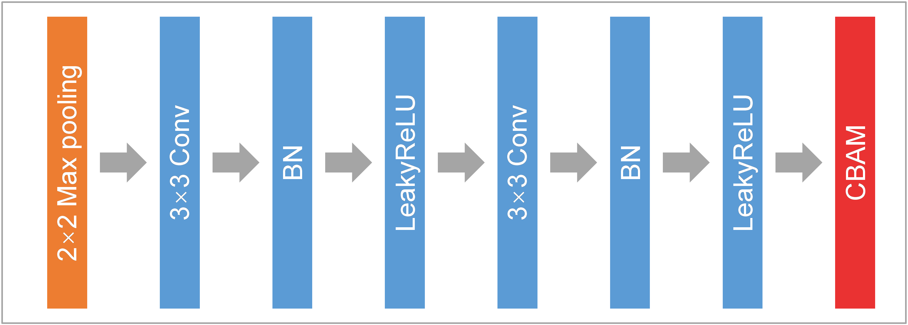
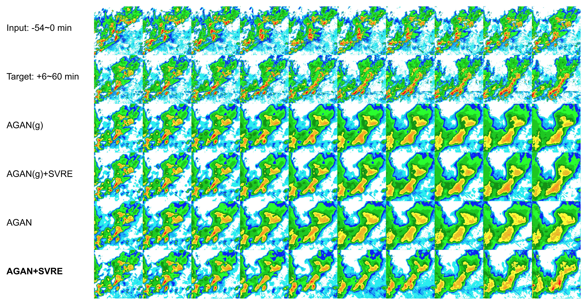
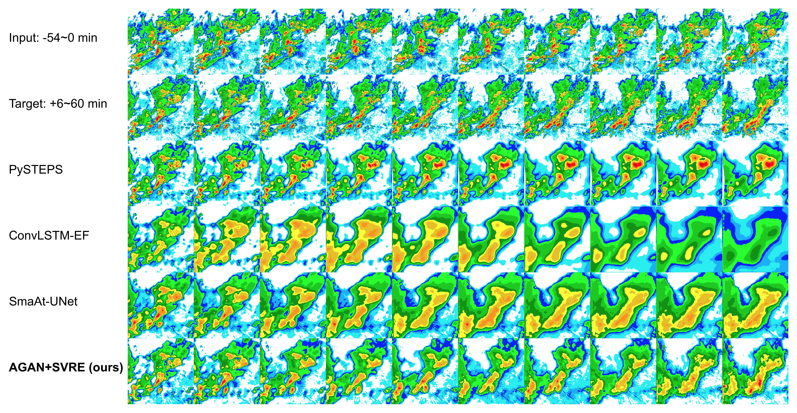

# Enhancing Spatial Variability Representation of Radar Nowcasting

<!-- Official implementation for the paper ["Enhancing Spatial Variability Representation of Radar Nowcasting"](https://www.overleaf.com/project/619b412332c8a949224fefaa). -->

## Description

This repo contains a PyTorch implementation of the **Spatial Variability Representation Enhancement (SVRE)** method and the **Attentional Generative Adversarial Network (AGAN)** for improving radar nowcasting.

### Model architecture

Generator


Discriminator


Scaling blocks

 

### Performance overview

Ablation study


Comparison study
  

## Dependencies

Since the codes are based on Python, you need to install Python 3.8 first. The following dependencies are also needed.

```pytorch=1.11.0
numpy=1.20.3
netcdf4=1.5.7
pandas=1.2.3
matplotlib=3.5.1
cartopy=0.18.0
pyproj=2.4.2.post1
```

## Usage

Run the bash scripts to train the model with the radar dataset.

Ablation study

```cd scripts
sh AttnUNet.sh
sh AttnUNet_SVRE.sh
sh AttnUNet_GA.sh
sh AttnUNet_GASVRE.sh
```

Comparison study

```cd scripts
sh PySTEPS.sh
sh ConvLSTM.sh
sh SmaAt_UNet.sh
sh AttnUNet_GASVRE.sh
```

The intermediate products such as the feature maps and the
pretrained models in this study are availble upon request.

## Citation

<!-- If you find this repo helpful, please cite the following article. -->
